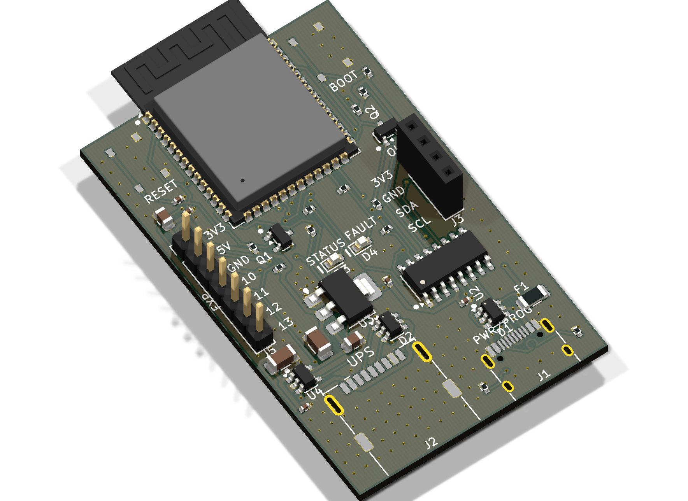
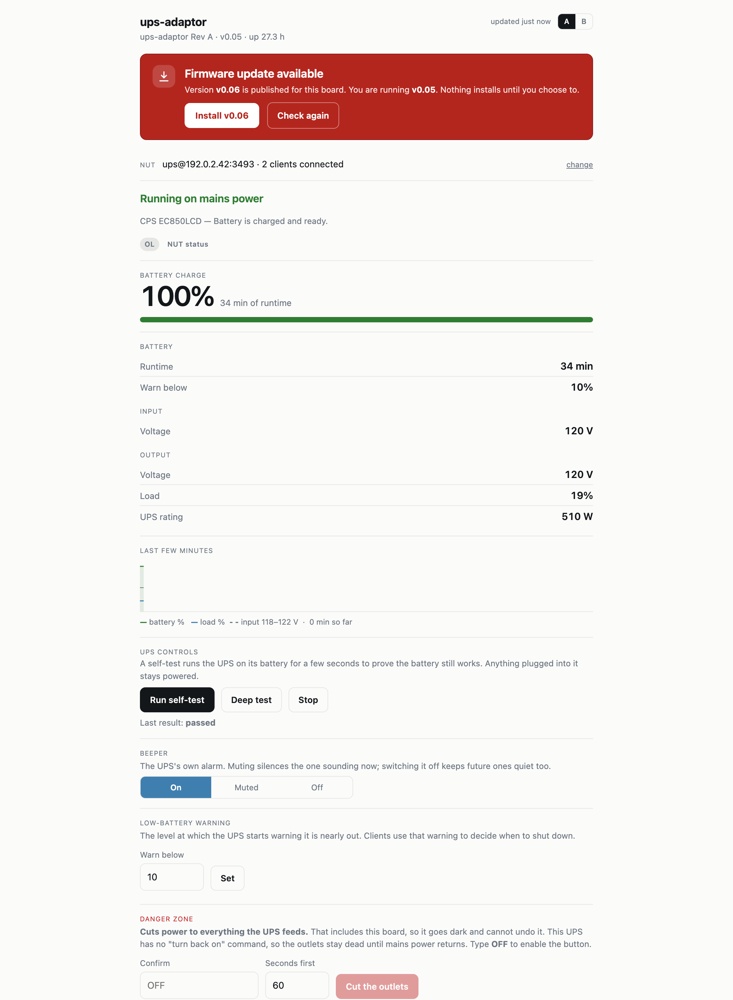
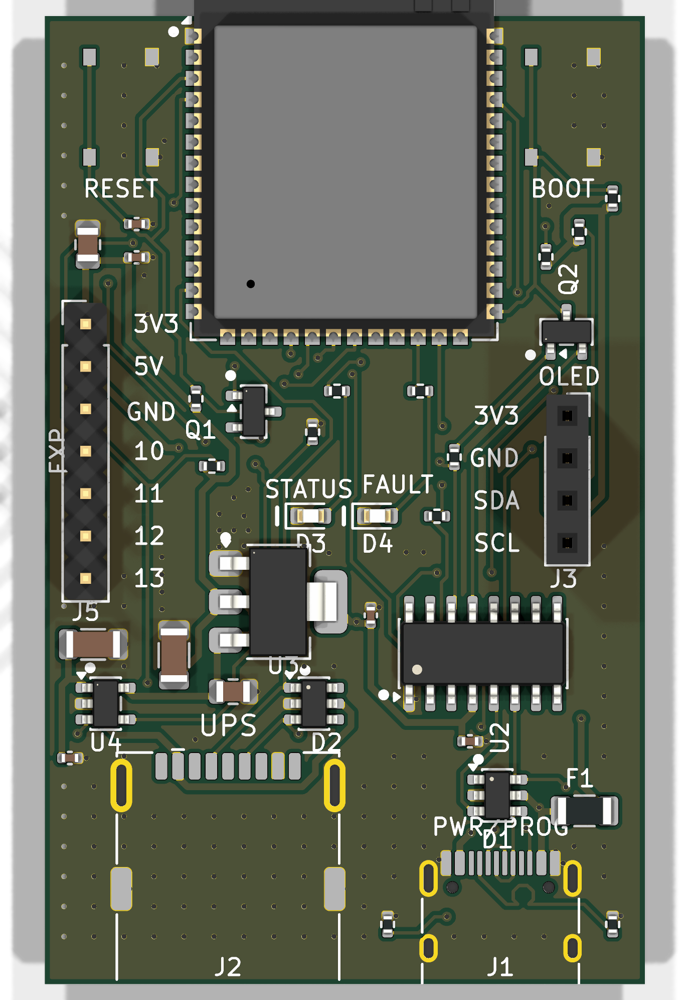
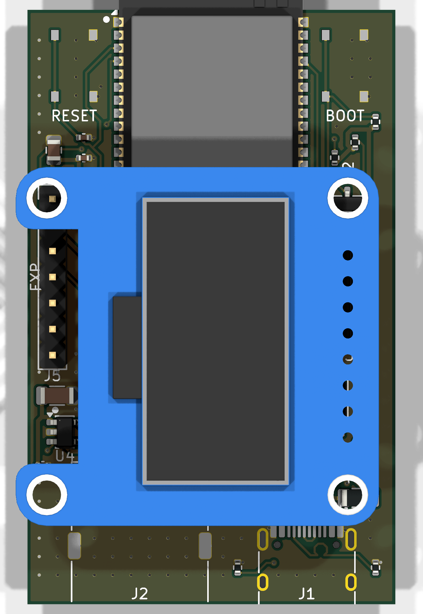

# ups-adaptor

**Put a USB-only UPS on your network, without leaving a computer next to it.**

A small ESP32-S3 board that plugs into a UPS's USB port, speaks USB HID Power Device to
it, and serves the readings over Wi-Fi as a **NUT server on TCP 3493**. Home Assistant,
Synology, TrueNAS, unraid and `upsmon` connect to it exactly as they would to a real
`upsd` — because it speaks the real protocol, not an approximation of one.



---

## The problem

A UPS in a rack, a basement or a cupboard has exactly one monitoring interface: a USB
type-B socket. To get it into Home Assistant you park a Raspberry Pi beside it and run
NUT — an entire Linux computer, its own power draw and its own SD card to corrupt, doing
nothing but translating a protocol.

Vendor network cards cost more than the UPS is worth. Most small UPSes cannot take one
at all.

This is the translator, and nothing else.

---

## It *is* NUT, as far as your clients are concerned

The firmware implements the NUT network protocol directly — `LIST UPS`, `LIST VAR`,
`LIST CMD`, `LIST RW`, `GET VAR`, `GET DESC`, `INSTCMD`, `SET VAR`, `LOGIN`, `LOGOUT`,
`VER`, and NUT's own error vocabulary (`ERR UNKNOWN-UPS`, `ERR VAR-NOT-SUPPORTED`,
`ERR CMD-NOT-SUPPORTED`, `ERR INVALID-ARGUMENT`). A client cannot tell it from `upsd`,
because there is nothing to tell apart.

A real session against a CyberPower EC850LCD, captured from the board:

```
$ nc ups-adaptor-XXXX.local 3493
LIST VAR ups
BEGIN LIST VAR ups
VAR ups device.type "ups"
VAR ups driver.name "ups-adaptor"
VAR ups ups.mfr "CPS"
VAR ups ups.model "EC850LCD"
VAR ups ups.status "OL"
VAR ups ups.beeper.status "enabled"
VAR ups ups.test.result "Done and passed"
VAR ups battery.charge "100"
VAR ups battery.runtime "2050"
VAR ups battery.charge.low "10"
VAR ups input.voltage "120.0"
VAR ups output.voltage "120.0"
VAR ups ups.load "19"
VAR ups ups.realpower.nominal "510"
END LIST VAR ups
```

Standard NUT variable names, standard status flags (`OL`, `OB`, `LB`, `CHRG`,
`DISCHRG`, `RB`). Point any NUT client at it:

| Client | Configuration |
|---|---|
| **Home Assistant** | Add the built-in **NUT** integration. Usually discovered on its own; otherwise host `ups-adaptor-XXXX.local`, port `3493`, UPS name `ups`, no credentials. |
| **Synology DSM** | Control Panel → Hardware & Power → UPS → *Network UPS server*, point at the board's address. |
| **TrueNAS / unraid** | UPS service in "slave"/network mode, same address and port. |
| **Linux** | `upsmon` / `upsc ups@ups-adaptor-XXXX.local` |

**Commands are discovered, not assumed.** The firmware reads the UPS's own report
descriptor and offers only what that unit implements — so `LIST CMD` on the CyberPower
above returns quick test, deep test, stop test, beeper enable/disable/mute and
`load.off`, while a UPS without a self-test usage is offered no self-test at all. The
same is true of the web UI's buttons.

MQTT with Home Assistant discovery is planned as a secondary output. NUT is the primary
one and always will be.

---

## The web UI



Everything the UPS reports, in words rather than protocol vocabulary — "Running on mains
power", not `OL` — with the raw NUT status alongside it for anyone who wants it. The NUT
connection string sits at the top, ready to paste into a client. The controls underneath
are the ones *this* UPS actually implements, and the destructive one asks you to type
`OFF` before it will arm.

*Shown with sample data rather than a real installation.*

---

## What else you get

- **A web UI** on port 80 — live readings, a battery gauge, the UPS's controls, and the
  NUT connection details ready to paste into a client.
- **Wi-Fi setup in a browser.** First boot raises a `ups-adaptor-XXXX` access point with
  a captive portal. No app, no serial console, no soldering.
- **Firmware updates over the air**, from this repository's GitHub releases. The board
  notices, tells you, and **installs nothing until you click**. A new image runs on
  trial: it has to stay up and keep serving for a while before it is kept, and the
  bootloader puts the old one back if it does not.
- **It refuses the wrong firmware.** Every image declares its board in its app
  descriptor, and a device checks that before writing a single byte. A Rev A image
  cannot be installed on a devkit, whatever the file is called.
- **Recovers by itself.** Wi-Fi reconnects with a capped backoff, and restarts the board
  if it somehow stays off the network. VBUS to the UPS runs through a current-limited
  load switch on a GPIO, so firmware can power-cycle a UPS interface that has wedged.
- **An optional OLED, from Rev B.** A 4-pin header for a 0.96" 128×64 SSD1306 module,
  for charge, runtime, input volts and load at a glance without opening a browser.
  **Rev A cannot use it: leave its header empty.** It reads 3V3, GND, SDA, SCL from
  pin 1 and standard modules read GND, VCC, SCL, SDA, so one seated in it is powered
  backwards. Rev A firmware does not drive a display at all.
- **mDNS** — `ups-adaptor-XXXX.local`, unique per board and matching its setup access point, advertising both `_http._tcp` and `_nut._tcp`.

Readings are **generic**. The parser walks the HID report descriptor rather than
matching a model, so a field a UPS does not report is *absent* rather than zero — a NUT
client treats any variable it receives as authoritative, and inventing one is worse than
omitting it.

---

## Tested for the things that actually happen

A UPS adaptor lives in a cupboard behind a machine nobody looks at. It is worth knowing
what it does when the room gets untidy, so these are exercised on real hardware rather
than assumed:

- **The UPS gets unplugged and plugged back in**, repeatedly, mid-session. It tears down,
  re-enumerates and carries on — no crash, no drift, no memory leaked per cycle.
- **The board starts with no UPS attached.** It waits quietly for one instead of
  thrashing at an empty port.
- **The UPS is already attached at power-on.** Readings inside a few seconds.
- **Wi-Fi drops, or the router reboots.** It reconnects on a backoff, and if it somehow
  stays off the network it restarts itself rather than sitting there invisible.
- **Power is cut without warning.** It comes back the way it went down.
- **A firmware update goes wrong.** The new image runs on trial and the bootloader puts
  the old one back unless it proves itself.
- **The wrong firmware is offered.** Refused before a single byte is written, because
  every image declares which board it is for.

It also reads UPSes from **two different manufacturers through one code path** — an APC
Back-UPS RS 1000G and a CyberPower EC850LCD — with no model-specific handling anywhere.
[`docs/tested-ups.md`](docs/tested-ups.md) records what each one reports **and what it
does not**: the CyberPower cannot store a battery replacement date, so the firmware does
not offer to set one.

Every change runs an automated check suite first — schematic and netlist rules, the power
budget, layout keepouts, manufacturing limits, the HID parser against real captured
descriptors, and both firmware targets building — none of which needs hardware attached.

And when something has shipped broken, it is written down rather than quietly fixed.
[`docs/RELEASING.md`](docs/RELEASING.md) names each one and why nothing caught it: a boot
loop from twelve URI handlers in a table sized for eight, a 4 KB stack that could not hold
a JSON response, an update path that could not download its own updates, a rollback that
was never cancelled. Each has a rule and a test behind it now.

---

## The board — Rev A

36 × 58 mm, two layers, ESP32-S3-WROOM-1-N4.



- **USB-A host port** to the UPS, with switched, current-limited VBUS — a UPS's USB port
  supplies no power, so the board must
- **USB-C** for power, programming and console via a CH340C with auto-reset
- ESD protection on both ports, a 2 A resettable fuse
- Expansion header, and an I²C header for an optional 128×64 SSD1306 OLED
- Every part on the top side, because JLCPCB's Economic PCBA places one side only

### With the optional display fitted



The I²C header is positioned so a standard 0.96" module sits **flat over the board**
rather than hanging off an edge. Illustrative: the 3D model is an Adafruit breakout
standing in for the generic modules most people buy — same SSD1306 controller, same
128×64 panel, a different board around it. Check your module's pin order against the
header before plugging it in; the pins are named on the silkscreen.

The board is **generated, not drawn.** `tools/` builds the schematic, placement, routing,
pours, silkscreen and fab outputs from source. Editing the `.kicad_pcb` by hand means
losing the edit on the next run.

---

## Getting started

**Flash a board** — download `ups-adaptor-<target>-full.bin` from
[Releases](../../releases) and write it to offset 0:

```sh
esptool.py --chip esp32s3 write_flash 0x0 ups-adaptor-reva-full.bin
```

**Then, with no cable at all:** join the `ups-adaptor-XXXX` access point, open
`http://192.168.4.1/`, pick your network. The board joins it while the setup page
is still open and shows you the address it was given, plus `http://ups-adaptor-XXXX.local/`. Point a NUT client at port 3493, UPS name `ups`, no
credentials.

**Build from source** — ESP-IDF v5.4:

```sh
cd firmware && idf.py build
tools/test/run-all.sh                  # the full check suite, no hardware needed
tools/pack-fab.sh                      # the files a PCB order takes
```

---

## Documentation

| | |
|---|---|
| [`docs/tested-ups.md`](docs/tested-ups.md) | which UPSes have been read on hardware, and what each exposes |
| [`docs/firmware.md`](docs/firmware.md) | architecture, HID-to-NUT mapping, the protocol subset, OTA |
| [`docs/hardware.md`](docs/hardware.md) | board specification, pin map, power tree |
| [`docs/hardware-schematic.md`](docs/hardware-schematic.md) | every net and pin, as built |
| [`docs/circuit.md`](docs/circuit.md) | the one-page circuit description |
| [`docs/BOM.md`](docs/BOM.md) | parts, with the substitutions that would destroy the board |
| [`docs/datasheet-audit.md`](docs/datasheet-audit.md) | every part checked against its datasheet, and what that found |
| [`docs/jlcpcb.md`](docs/jlcpcb.md) | manufacturing limits, and what to check before ordering |
| [`docs/reva-readiness.md`](docs/reva-readiness.md) | every way the real board differs from the development one, and the bring-up order |
| [`docs/RELEASING.md`](docs/RELEASING.md) | the rules for shipping firmware, and what each one cost to learn |
| [`docs/TOOLCHAIN.md`](docs/TOOLCHAIN.md) | what to install, and the traps |

---

## State of this project

**The firmware works and runs today** on an ESP32-S3 development board: it enumerates a
UPS, parses its descriptor, polls feature reports, serves the web UI, answers the NUT
protocol and updates itself over the air.

**Rev A boards are on order.** The design is clean against KiCad's own rules and against
the manufacturer's limits — no clearance violations, nothing unconnected, no isolated
copper — and the gerbers, BOM and placement files are generated and committed ready to
order. No board has been powered yet, and nothing in these documents claims otherwise.

| | |
|---|---|
| Firmware: USB host, HID parsing, feature polling | **working** |
| Web UI: provisioning, captive portal, live status, controls | **working** |
| NUT server on 3493 | **working** |
| OTA firmware update from GitHub releases | **working** |
| MQTT with Home Assistant discovery | planned |
| Rev A board built and brought up | on order |

---

## Licence

**Firmware and tools: GPL-3.0-or-later** ([`LICENSE`](LICENSE)); every source file
carries an SPDX header. Copyleft on purpose — it keeps derivatives open, and it is what
allows reusing logic from NUT, whose `usbhid-ups` is GPL-2.0-or-later.

**Hardware: CERN-OHL-S v2** ([`hardware/LICENSE`](hardware/LICENSE)). Make and sell the
board freely; publish your sources if you distribute a modified version.

One third-party file is redistributed: `tools/test/jlc_cpl_rotations.csv`, a verbatim
copy of the reel-rotation table from
[JLCKicadTools](https://github.com/matthewlai/JLCKicadTools), GPL-3.0-or-later, with its
provenance in the file's own header.

## How this was built

**The project is a person's.** The idea, the decision to build a dedicated translator
rather than park a Pi next to the UPS, the choice of NUT as the primary protocol, the
board's plan and layout, the part choices and the constraints they had to satisfy, and
the design of how the firmware should behave — those are the author's, and they are the
decisions that determined what this is.

Some of them are written down in this repository because they were argued about:
ESP32-S3 because a classic ESP32 has no USB host peripheral and physically cannot do
this; a pre-made module rather than a bare chip, because the certification and the
crystal are worth more than the dollar saved; a switched load switch on VBUS rather than
hardwiring it, so firmware can power-cycle a UPS interface that has wedged; single-sided
placement, because that is what an affordable assembly service will actually build; NUT
first and MQTT second, because NUT is what the clients people already own speak.

**Claude Code did a great deal of the building.** The firmware, the KiCad generation
scripts, the test harness and most of these documents were written by
[Claude Code](https://claude.com/claude-code), working against real hardware and
reviewed as it went. It is fast at turning "this is how it should behave" into something
that compiles, and relentless about writing the check that stops a defect coming back.

The collaboration shows in the result. Some of the sharpest findings here came from a
human looking at a confident answer and saying it was wrong — a debugging session chasing
a power fault that was not a power fault, and a crash correctly predicted from "it only
happens with no UPS attached" before anyone had read the code that proved it. Others came
from the machine being more patient than a person has any reason to be: a regulator with
10 mV of dropout headroom, 25 parts placed on the side of a board that cannot be
assembled, a rotation table that fitted a transistor sideways, a page that reported a
healthy battery as FAILED.

It is also why the test harness is the size it is. Every measured claim in these
documents comes from an instrument, a capture or a check you can re-run, and
`tools/test/run-all.sh` is how you verify the design rather than take anyone's word for
it — the author's or the machine's.
